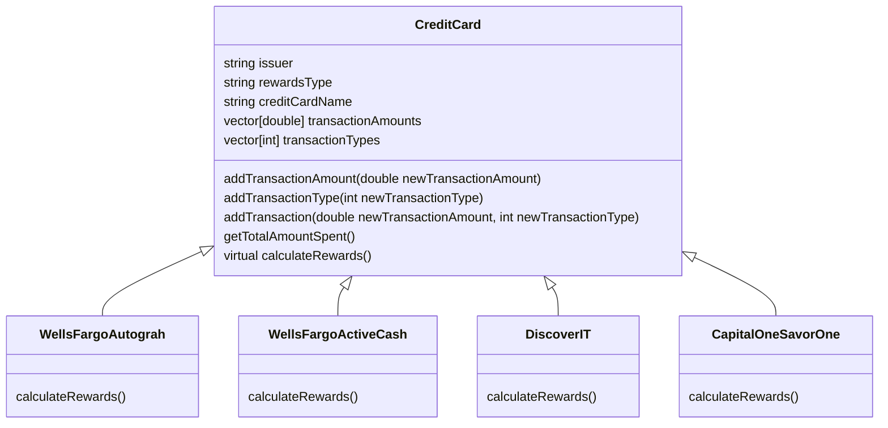

# Credit Card Rewards Calculator

Use this calculator to calculate rewards across all cards together.

## CreditCards
1. Wells Fargo Autograph
2. Wells Fargo Active Cash
3. Discover IT
4. Capital One Savor One

---

## Transaction Types

| Transaction Type  | Number |
| ----------------- | ------ |
| Restaurants       | 1      |
| Travel            | 2      |
| Gas               | 3      |
| Transit           | 4      |
| Streaming Service | 5      |
| Phone Plans       | 6      |
| Paypal            | 7      |
| Entertainment     | 8      |
| Groceries         | 9      |
| Hotel             | 10     |
| Rental Car        | 11     |
| Other             | 12     |
